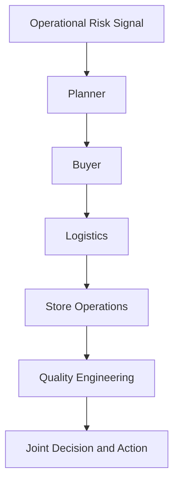

# 03. Roles and Responsibilities

[Home](./index.md) | Previous: [Chapter 2](./chapter2.md) | Next: [Chapter 4](./chapter4.md)

## Cross-Functional Ownership Drives Supply Chain Performance

Grocery operations fail when accountability is ambiguous. The same stockout can involve planning, buying, transport, store execution, and system integration. High-performing chains define who decides, who executes, and who approves at each stage.

## Decision Rights by Operating Layer

A practical responsibility model looks like this:

- Demand planning: owns baseline forecast and exception adjustments.
- Category and merchandising: own promotion plans and assortment choices.
- Procurement: owns supplier commitments and purchase order release.
- Logistics: owns transport scheduling and capacity constraints.
- DC operations: own receiving, storage discipline, and dispatch reliability.
- Store operations: own shelf execution, substitutions, and cycle counts.
- Product and engineering: own system workflows, observability, and defect response.
- Quality engineering: own risk-based validation and release confidence.

Without clear decision rights, teams either duplicate work or wait for each other while service degrades.

## RACI in Real Grocery Programs

Large grocery programs usually apply a lightweight RACI for high-risk processes:

- Promotion planning: planning accountable, merchandising and suppliers responsible, stores consulted.
- Lead-time override: procurement accountable, planning consulted, transport informed.
- Allocation exception during shortage: inventory control accountable, stores and customer care informed.
- Major integration incident: engineering accountable, operations responsible for containment, business leadership informed.

The goal is response speed, not bureaucracy.

## Grocery Scenario: Supplier Lead-Time Drift Before Holiday Period

A private-label bakery supplier extends lead time from 7 to 11 days due to labor constraints. If this change is not governed, forecast conversion still assumes 7-day replenishment and store coverage erodes.

Coordinated response:

1. Supplier manager confirms revised capacity and ship calendar.
1. Planner updates lead time assumptions and increases near-term safety stock for priority stores.
1. Buyer advances purchase order release dates.
1. Transport secures additional slots for earlier pickup windows.
1. Store operations tighten markdown controls to preserve sellable inventory.
1. QE validates that revised lead time values propagate through planning, ordering, and replenishment flows.

## Organizational Anti-Patterns

- Treating incidents as "system issues" when root cause is process ownership ambiguity.
- Running weekly planning cadences for categories that require daily intervention.
- Escalating only after stockouts reach stores instead of managing upstream risk indicators.

## Team Design Recommendations

- Define single-threaded owners for forecast, replenishment, and supplier reliability by category.
- Track cross-functional service-level objectives, not only functional KPIs.
- Include store operations in planning retrospectives; shelf reality should shape policy.
- Build shared war-room playbooks for weather events, strikes, and promotion spikes.

Retail grocery performance is an orchestration problem. Clear ownership converts complexity into repeatable execution.

## Visual: Cross-Functional Decision Escalation

## Transition to Chapter 4

Once ownership is clear, planning quality becomes the core performance lever. The next chapter covers forecasting and inventory planning decisions in detail.

---

[Home](./index.md) | Previous: [Chapter 2](./chapter2.md) | Next: [Chapter 4](./chapter4.md)

