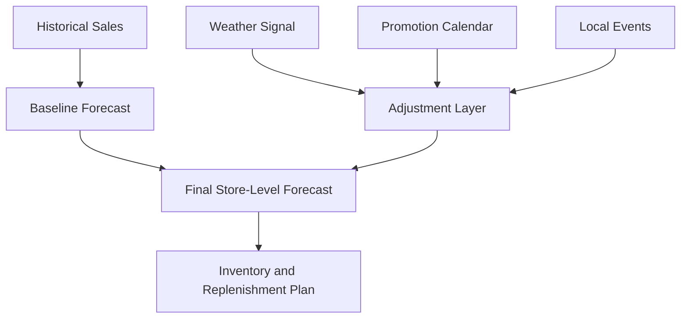
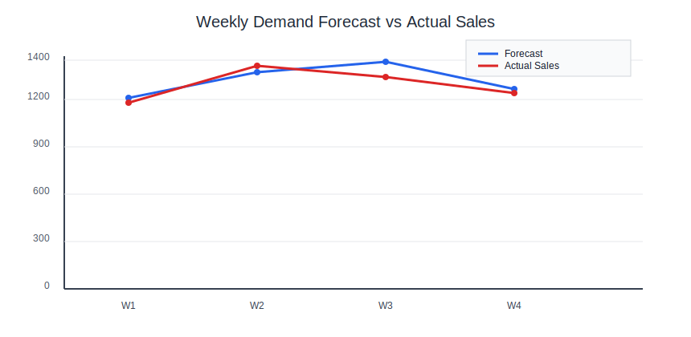

## Forecasting in Grocery: Precision by Time, Place, and Cause

Grocery forecasting is a multi-horizon exercise. Teams need:

- Strategic forecasts for supplier contracts and seasonal sourcing.
- Tactical forecasts for weekly purchase commitments.
- Near-real-time adjustments for weather, promotions, and local events.

A single annual or monthly forecast is not enough. Fast-moving categories need daily or intraday correction, especially when shelf life is short.

## Forecast Architecture

Most professional retailers use a layered approach:

1. Baseline demand: expected sales without promotion or disruption.
1. Seasonal profile: periodic patterns (holiday weeks, summer beverages, back-to-school snacks).
1. Event uplift: promotions, price changes, media campaigns, local festivals.
1. Constraint overlay: supplier capacity, transport limits, and shelf-space ceilings.

The planning output is not just "units forecasted." It becomes purchase orders, allocation targets, labor plans, and customer service commitments.

## Inventory Planning and Safety Stock Logic

Forecasts feed inventory policy decisions:

- Cycle stock: inventory consumed between replenishment events.
- Safety stock: buffer against demand and lead time uncertainty.
- Reorder point: trigger level for replenishment release.

In grocery, safety stock must be category-sensitive. Frozen vegetables can carry more buffer than ready-to-eat deli items. High-velocity essentials (milk, eggs, bread) require high service reliability with tight freshness management.

## Grocery Scenario: Thanksgiving Capacity Planning

A Kroger-like chain prepares for Thanksgiving. Demand rises sharply for turkey, butter, cream, baking ingredients, and side-dish categories.

Execution sequence:

1. Planners create baseline by store cluster using prior-year uplift plus trend.
1. Merchandising adds ad-calendar impact and planned price reductions.
1. Procurement confirms supplier capacity and production lock windows.
1. Inventory planners increase safety stock for high-service categories while constraining perishable overbuy.
1. Allocation logic prioritizes high-demand stores with limited backroom space.

During event week, teams monitor forecast error daily and adjust allocation waves. The objective is to avoid both shelf-outs and excess post-holiday markdown.

## Interpreting Forecast Error Correctly

Forecast accuracy metrics (MAPE, WAPE, bias) should trigger action, not reporting theater.

- Positive bias (over-forecast) in fresh categories often indicates waste risk.
- Negative bias (under-forecast) in staples indicates customer service risk.
- A low aggregate error can hide severe error in top revenue SKUs.

Best practice is segmented accuracy review by category, store archetype, and promo intensity.

## Common Planning Failures

- Applying a single service-level target across all categories.
- Ignoring cannibalization when promotions shift demand within category.
- Updating forecasts without synchronizing replenishment and transport constraints.
- Measuring planner performance only on error, not on business outcomes.

## Operating Guidance

- Establish exception thresholds that trigger same-day replanning.
- Keep promotion assumptions explicit and testable.
- Validate that lead time changes automatically recalculate reorder points.
- Pair forecast reviews with supplier and store execution reviews.

Forecasting is only valuable when it changes the right decisions early enough to matter.

## Visual: Forecast Decomposition

## Visual: Demand Planning Review Chart

## Worked Example: Demand Forecasting With Promotion Uplift

### Scenario

A supermarket tracks weekly yogurt demand for one store cluster.

| Week | Baseline Forecast (units) | Promotion Uplift (units) | Final Forecast (units) | Actual Sales (units) |
| --- | ---: | ---: | ---: | ---: |
| W1 | 1,150 | 0 | 1,150 | 1,120 |
| W2 | 1,180 | 120 | 1,300 | 1,340 |
| W3 | 1,200 | 160 | 1,360 | 1,310 |
| W4 | 1,210 | 0 | 1,210 | 1,180 |

### Calculation

MAPE per week = `abs(Actual - Forecast) / Actual`

- W1: `abs(1120-1150)/1120 = 2.68%`
- W2: `abs(1340-1300)/1340 = 2.99%`
- W3: `abs(1310-1360)/1310 = 3.82%`
- W4: `abs(1180-1210)/1180 = 2.54%`

Average MAPE = `(2.68 + 2.99 + 3.82 + 2.54) / 4 = 3.01%`

### Interpretation

A 3.01% average MAPE is strong for a promoted perishable category. The largest miss occurred during peak uplift week (W3), indicating the promo elasticity factor should be recalibrated.

## Worked Example: Safety Stock Calculation

### Inputs

| Parameter | Value |
| --- | ---: |
| Target service level (`Z`) | 1.65 |
| Daily demand standard deviation (`sigma_d`) | 80 units |
| Supplier lead time | 3 days |

### Formula

Safety stock = `Z x sigma_d x sqrt(Lead time)`

Safety stock = `1.65 x 80 x sqrt(3)`

Safety stock = `1.65 x 80 x 1.732 = 228.6` units

Rounded safety stock = **229 units**

### Interpretation

The store cluster should hold 229 units as uncertainty buffer. If lead time variability rises (for example, from 3 to 5 days), safety stock should be recalculated immediately.

## Worked Example: Reorder Point Calculation

### Inputs

| Parameter | Value |
| --- | ---: |
| Average demand | 500 units/day |
| Lead time | 3 days |
| Safety stock | 229 units |

### Formula

Reorder point = `(Average demand x Lead time) + Safety stock`

Reorder point = `(500 x 3) + 229 = 1,729 units`

### Interpretation

When inventory position falls to 1,729 units, replenishment must trigger. Any manual delay in order release increases stockout risk during lead time window.

## Transition to Chapter 5

Forecast quality sets the demand signal, but supplier execution determines whether that signal becomes physical inventory. The next chapter focuses on procurement and vendor management.

