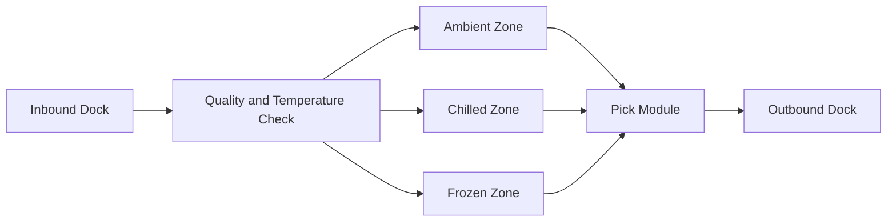
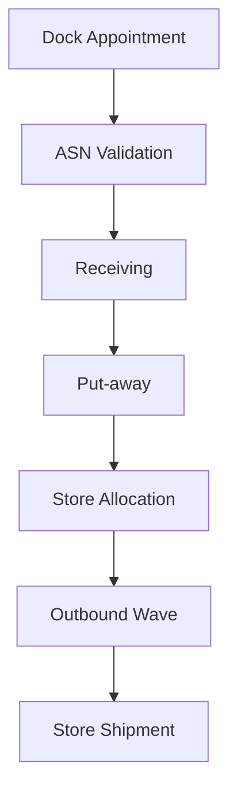

## Inbound Logistics Sets the Pace for Store Service

Inbound performance determines whether replenishment plans become physical reality. Grocery DCs handle multiple temperature classes, mixed pallet profiles, and tight dispatch schedules. A delay at receiving can cascade into next-day shelf gaps.

## Warehouse Operating Model

A typical grocery DC runs four interconnected workflows:

1. Appointment and dock planning: align truck arrivals with labor and storage capacity.
1. Receiving and quality control: validate ASN, quantity, temperature, and damage status.
1. Put-away and storage: route inventory to ambient, chilled, frozen, or quarantine zones.
1. Picking and dispatch: consolidate store orders into outbound waves by route and cut-off.

The highest-performing sites manage these as one flow, not isolated departments.

## Cold Chain Execution Requirements

For temperature-sensitive categories, process discipline is non-negotiable:

- Temperature checks at gate, dock, and storage location.
- Maximum dwell-time limits outside controlled zones.
- FEFO (first-expiry-first-out) rotation for short shelf-life items.
- Exception handling for temperature excursions with immediate disposition rules.

A cold-chain miss is both a service and food-safety risk.

## Grocery Scenario: Mixed Load Arrival During Peak Window

A Walmart-scale regional DC receives a mixed load containing frozen meals, dairy, produce, and ambient snacks during a high-volume pre-weekend window.

Operational sequence:

1. Gate system verifies appointment and priority class.
1. Receiving team validates ASN and inspects seal integrity.
1. Frozen and chilled pallets are unloaded first to reduce thermal exposure.
1. WMS assigns locations by temperature zone and replenishment urgency.
1. Inventory control flags shelf-life exceptions for quality review.
1. Outbound planners include high-priority SKUs in same-day dispatch waves.

When execution is tight, stores receive high-demand perishables before evening peaks with minimal waste.

## Throughput and Labor Balancing

Warehouse performance is a balancing problem between service speed and handling efficiency. Core control levers include:

- Wave design based on route cutoff and store urgency.
- Slotting optimization to reduce picker travel time.
- Labor cross-training for receiving and picking surge flexibility.
- Dock utilization management to avoid queue build-up.

Teams that optimize only productivity metrics can accidentally harm dispatch reliability. Service-level metrics must remain primary.

## Common Failure Modes

- Dock schedules disconnected from transport realities.
- ASN inaccuracies discovered too late in receiving.
- Poor slotting for high-velocity items causing pick congestion.
- Cold-chain exception handling that is manual and delayed.

## Practical Control Checklist

- Track dock-to-stock cycle time by temperature class.
- Monitor pick accuracy and dispatch SLA by store cluster.
- Run hourly visibility on at-risk outbound waves.
- Audit FEFO compliance for top perishable categories.

Inbound and warehouse operations are where strategy meets physics. Execution detail determines whether planning promises are kept.

## Visual: Warehouse Temperature-Zone Layout

## Visual: Inbound to Dispatch Cycle

## Worked Example: Warehouse Throughput and Dock Utilization

### Scenario Inputs

| Parameter | Value |
| --- | ---: |
| Inbound pallets received in one shift | 1,260 |
| Shift duration | 9 hours |
| Active receiving doors | 7 |

### Throughput Calculation

Throughput per hour = `Total pallets / Shift hours`

Throughput per hour = `1,260 / 9 = 140 pallets/hour`

### Door Utilization Calculation

Pallets per door per hour = `140 / 7 = 20 pallets/door/hour`

If engineered target = 23 pallets/door/hour, then utilization gap = `23 - 20 = 3 pallets/door/hour`

### Interpretation

The site is operating below engineered door productivity. Root-cause checks should focus on appointment punctuality, unload staffing, and ASN accuracy because each can throttle effective dock cycle speed.

## Transition to Chapter 7

With warehouse flow in place, the next challenge is retail execution. The next chapter covers replenishment policy, shelf availability, and omnichannel fulfillment.

