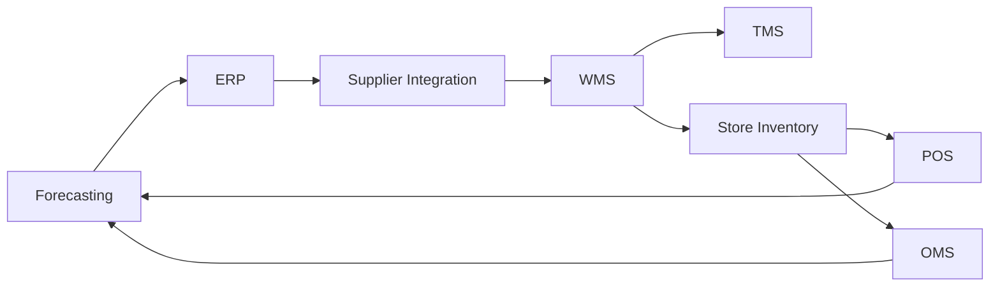

## Systems Landscape: One Business, Many Platforms

A grocery retailer typically operates ERP, forecasting, WMS, TMS, POS, OMS, pricing, and integration platforms. The business experiences one supply chain; technology delivers it through distributed systems. Reliability depends on integration quality and operational observability.

## Canonical Data Flows

The minimum critical flow is:

1. Forecast and replenishment outputs create supply signals.
1. ERP issues purchase orders and receives confirmations.
1. Supplier messages (EDI/API) provide shipment and ASN status.
1. WMS processes receipt, inventory position, and dispatch events.
1. Store and OMS systems consume inventory updates for selling and fulfillment.
1. POS and order completion feed demand back to forecasting.

Any delay or schema mismatch can distort planning and customer commitments.

## Integration Patterns and Tradeoffs

Common patterns in grocery environments:

- Event streaming for near-real-time inventory updates.
- API orchestration for synchronous business transactions.
- Batch jobs for large periodic data synchronization.
- EDI gateways for supplier interoperability.

Choosing the wrong pattern can create hidden latency. For example, daily batch inventory updates are often insufficient for same-day delivery promises.

## Grocery Scenario: Inventory Drift Between WMS and OMS

A chain launches a flash promotion on household essentials. WMS inventory is correct, but OMS receives delayed updates due to a failed message queue consumer.

Business impact:

- OMS oversells stock at selected stores.
- Customer orders require substitution or cancellation.
- Store teams spend additional labor on exception handling.

Technical and operational response:

1. Detect drift using automated reconciliation checks.
1. Pause affected order promises for impacted SKUs.
1. Replay inventory events from durable queue offsets.
1. Confirm parity and then restore normal order flow.
1. Add alert thresholds for update-lag and backlog depth.

## Reliability Controls

Professional teams implement explicit controls:

- Contract tests for interface schemas and mandatory fields.
- Idempotency keys for retry-safe transactions.
- Dead-letter queue workflows with ownership and SLA.
- End-to-end traceability from PO creation to shelf sale.
- Business-facing dashboards for data freshness and event lag.

## Practical Recommendations

- Define canonical ownership for each critical business entity (item, inventory, order, shipment).
- Instrument integration latency by business impact, not only by system health.
- Run game-day simulations for queue failures and stale data conditions.
- Treat integration defects as service incidents with measurable customer impact.

In modern grocery operations, systems integration quality is operational quality.

## Visual: Core System Integration Map

## Transition to Chapter 9

Once architecture is defined, validation discipline is required to protect business outcomes. The next chapter presents quality-engineering scenarios and release controls.
