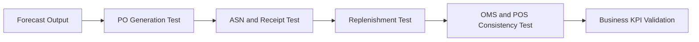

## Quality Engineering Focus: Protect Business Outcomes

In grocery supply chains, quality engineering must validate business continuity, not only application correctness. The test question is: can the business still keep shelves stocked and customer promises accurate under realistic operating conditions?

## Risk-Based Test Design

High-value test coverage starts with process risk:

- Forecast-to-order correctness for high-volume SKUs.
- Supplier confirmation and ASN reliability.
- Inventory consistency between WMS, store, and OMS.
- Replenishment rule behavior during demand shocks.
- Substitution and cancellation logic in digital fulfillment.

Coverage depth should follow business criticality and blast radius.

## Scenario Library Structure

A professional scenario library includes:

1. Happy path for each end-to-end flow.
1. Known high-frequency exceptions (late ASN, partial receipt, short ship).
1. High-impact edge conditions (promotion spikes, weather events, integration lag).
1. Recovery scenarios (replay, failover, backfill, rollback).

Each scenario should tie to measurable KPIs such as shelf availability, fill rate, and order completion.

## Grocery Scenario: Promotion Spike Regression

A chain runs a two-day detergent promotion expected to double volume.

QE objectives:

- Validate uplift forecast reaches ordering logic.
- Confirm supplier acknowledgment handling for split shipments.
- Verify DC receipts update inventory with correct units of measure.
- Ensure store replenishment and OMS both consume current on-hand values.
- Validate substitution hierarchy when preferred SKU depletes.

Release decision should require both technical pass rates and acceptable business KPI simulation outcomes.

## Test Data and Environment Strategy

Supply chain testing fails when data is unrealistic. Teams should maintain:

- Production-like item masters with representative pack sizes and shelf-life attributes.
- Supplier profiles with varied lead time distributions.
- Store clusters with diverse demand patterns.
- Controlled event calendars for promotions and seasonality.

Data quality in test environments is a prerequisite for trusted release signals.

## Example Test Coverage Matrix

| Flow Area | Primary Risk | Validation Signal | Business KPI Guardrail |
| --- | --- | --- | --- |
| Forecast to PO | Under-order during promo | Forecast uplift reflected in PO quantity | Shelf availability >= target |
| Supplier to DC | Missing or late ASN | ASN received before dock window | Receiving delay below threshold |
| DC to Store | Dispatch miss | Outbound wave closes before route cutoff | Store fill rate >= target |
| Store to OMS | Inventory drift | POS and OMS on-hand delta within tolerance | Order cancellation rate <= target |
| Fulfillment | Poor substitutions | Approved substitution rules applied | Customer complaint rate within baseline |

## Practical Recommendations

- Tie release gates to business-impact scenarios, not only code coverage.
- Keep an always-on smoke suite for critical inventory and ordering flows.
- Add observability assertions (event lag, queue depth) to non-functional tests.
- Run post-release KPI verification as part of done criteria.

Quality engineering is strongest when it speaks the language of operations and customer outcomes.

## Visual: QE Validation Across the Supply Chain

## Transition to Chapter 10

With risk-based validation in place, the next chapter walks a single SKU through the full lifecycle to connect planning, execution, and performance feedback.

