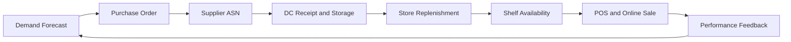

## One SKU Through the Full Grocery Lifecycle

This chapter follows a single chilled yogurt SKU from planning through customer purchase and feedback. The purpose is to show where decisions interact, where latency appears, and where risk controls matter.

## Stage 1: Demand and Supply Planning

The demand planning team forecasts weekly store-level sales using baseline trend, weather signals, and upcoming promotions. Inventory planning converts forecast into safety stock and reorder triggers based on lead-time reliability and freshness constraints.

Key risk: over-forecast drives expiration waste; under-forecast drives shelf-outs.

## Stage 2: Purchase Order and Supplier Commitment

Procurement releases purchase orders to the supplier based on planned demand windows. Supplier acknowledgments confirm quantity and ship dates.

Key risk: supplier commits volume but misses ship date, compressing DC receiving and store replenishment windows.

## Stage 3: Inbound and DC Execution

Supplier sends ASN data. At DC receiving, teams validate quantity, temperature, and shelf-life requirements. Inventory is placed in chilled storage with FEFO rotation and prepared for outbound allocation.

Key risk: late receipt or temperature excursion reduces sellable life and downstream availability.

## Stage 4: Store Replenishment and Shelf Execution

Store orders are dispatched from DC based on route schedule and store demand profile. At store level, yogurt moves from receiving to backroom to shelf with frequent freshness checks.

Key risk: system on-hand shows available, but shelf is empty due to backroom execution lag.

## Stage 5: Omnichannel Fulfillment and Last Mile

Online orders reserve inventory from store stock. Pickers follow substitution rules when preferred pack sizes are unavailable. Delivery windows and pickup promises depend on current shelf and backroom accuracy.

Key risk: stale inventory data causes substitutions or cancellations after order commitment.

## Stage 6: Feedback Loop and Continuous Improvement

POS sales, order outcomes, waste events, and returns feed back into planning, procurement, and replenishment parameter updates.

Key risk: teams review KPIs in isolation and miss systemic root causes.

## Lifecycle Scenario: Summer Demand Surge

A heatwave increases yogurt and smoothie demand across urban stores.

Cross-functional response:

1. Forecasts are re-baselined using near-real-time sell-through.
1. Procurement advances orders with top supplier lanes.
1. DC shifts labor from ambient to chilled outbound waves.
1. Store teams increase replenishment cadence for dairy aisle.
1. Last-mile operations expand evening delivery capacity.
1. Post-event review updates safety stock and route calendars.

The chain protects availability while controlling spoilage through coordinated decisions across all stages.

## KPI Set for End-to-End Control

- Forecast accuracy and bias by store cluster.
- Supplier OTIF and ASN timeliness.
- Dock-to-stock cycle time for chilled categories.
- Store shelf availability and out-of-stock duration.
- Digital order completion and substitution rate.
- Waste percentage and markdown recovery.

End-to-end visibility is the difference between reactive firefighting and controlled execution.

## Visual: End-to-End Lifecycle Flow

