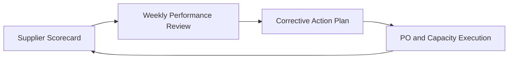

# Chapter 5. Procurement and Supplier Management

[Home](../index.md) | Previous: [Chapter 4](./chapter4.md) | Next: [Chapter 6](./chapter6.md)

## Procurement as a Reliability Function

In grocery retail, procurement is not only about negotiated unit cost. It is a reliability function that protects service level and margin. A low-cost supplier with weak delivery consistency can create greater total cost through expedites, stockouts, substitutions, and lost customer trust.

## Supplier Segmentation

Mature grocery retailers segment suppliers by business criticality:

- Strategic suppliers: high-volume or high-risk categories requiring joint business planning.
- Core suppliers: stable volume with standard performance governance.
- Opportunistic suppliers: seasonal or tactical sourcing.

Each segment receives a different cadence for review, escalation, and improvement plans.

## Contract and Operating Levers

Beyond price, procurement teams shape outcomes through:

- Lead-time commitments and variability tolerances.
- Minimum order quantity and order frequency flexibility.
- OTIF targets and service penalties.
- Shelf-life and quality acceptance criteria.
- Data standards for EDI/API confirmations and ASNs.

These clauses should map to measurable operational behaviors, not legal language that cannot be enforced in daily execution.

## Grocery Scenario: Private-Label Expansion

A Costco-like retailer expands a private-label canned vegetable assortment before peak season.

Procurement playbook:

1. Qualify two suppliers per critical SKU family to reduce single-source risk.
1. Lock volume bands and flex ranges for surge scenarios.
1. Align packaging and pallet standards with DC receiving constraints.
1. Set OTIF thresholds with weekly service scorecards.
1. Require early warning windows for production disruptions.

When one supplier misses production due to a line outage, procurement shifts incremental volume to the second supplier and protects service continuity with minimal expedited freight.

## Supplier Performance Management

An effective scorecard combines commercial and operational signals:

- OTIF by lane and SKU.
- Fill rate against purchase order quantity.
- ASN accuracy and timeliness.
- Defect rate at receiving.
- Responsiveness to exception escalations.

Review rhythm matters. High-risk categories often require weekly operational reviews, with monthly executive reviews focused on trend and corrective action effectiveness.

## Failure Modes to Avoid

- Awarding business on unit cost alone.
- Accepting lead time assumptions without historical variance analysis.
- Treating all service misses as equivalent (missing frozen protein is not equal to missing low-velocity pantry item).
- Weak integration between supplier portals and internal planning systems.

## Practical Recommendations

- Build supplier continuity plans for top revenue and top risk categories.
- Predefine substitution and emergency sourcing rules before disruptions occur.
- Connect supplier scorecard results to replenishment policy adjustments.
- Include procurement in post-promotion retrospectives to refine future commitments.

Procurement excellence in grocery is the discipline of converting supplier agreements into consistent shelf outcomes.

## Visual: Supplier Performance Control Loop

## Transition to Chapter 6

Supplier commitments only create customer value when inbound and warehouse execution are reliable. The next chapter addresses that operational layer.

---

[Home](../index.md) | Previous: [Chapter 4](./chapter4.md) | Next: [Chapter 6](./chapter6.md)

