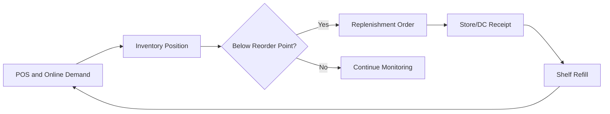
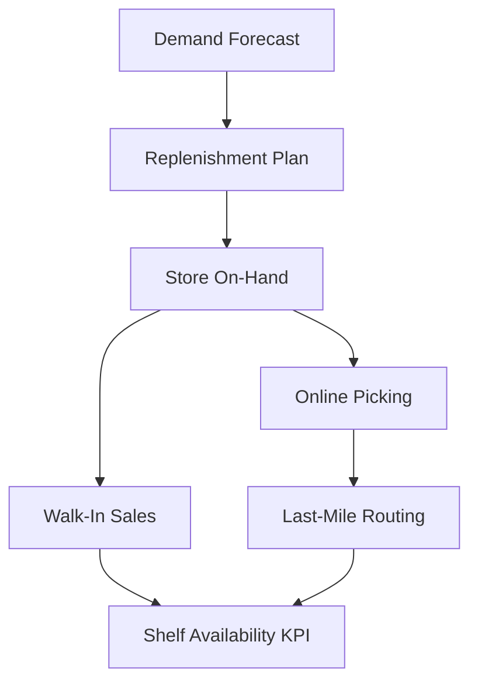

# Chapter 7. Replenishment, Store Operations, and Fulfillment

[Home](../index.md) | Previous: [Chapter 6](./chapter6.md) | Next: [Chapter 8](./chapter8.md)

## Replenishment Is the Bridge Between Inventory and Availability

Inventory only creates value when it is available at the shelf or fulfillable for digital orders. Replenishment connects planning decisions to customer experience by determining when, how much, and where to move stock.

## Replenishment Models in Grocery

Common models include:

- Min/max replenishment: reorder when on-hand falls below a threshold up to a target level.
- Reorder point with safety stock: trigger based on forecasted consumption during lead time plus uncertainty buffer.
- Allocation-based replenishment: distribute constrained inventory across stores based on priority rules.
- Dynamic daily reorder: near-real-time adjustments using POS and fulfillment demand.

Large chains use a blend by category and store profile rather than one universal model.

## Retail Store Inventory Flow

In-store flow has three key zones:

1. Backroom receipt and temporary staging.
1. Shelf replenishment and facing maintenance.
1. Online order picking from shelf or dedicated micro-fulfillment area.

If these flows are poorly synchronized, the system may show "in stock" while the shelf is empty, driving both walkout loss and failed pickup orders.

## Omnichannel Contention and Last-Mile Effects

Last-mile promises (same-day delivery, two-hour pickup windows) consume local inventory and compress store operating buffers. Grocery operations teams need explicit prioritization rules:

- Reserve inventory for confirmed digital orders at defined cutoffs.
- Define substitution logic by category and customer preference.
- Protect on-shelf availability for destination categories.
- Align dispatch windows with in-store picking capacity.

An Amazon Fresh-style model relies on rapid inventory updates and strong substitution governance to protect customer satisfaction.

## Grocery Scenario: Weekend Promotion With Omnichannel Surge

A regional chain runs a weekend snack and beverage promotion while online order volume rises 40% due to severe weather.

Response playbook:

1. Replenishment analysts increase reorder frequency for high-velocity SKUs.
1. Allocation engine prioritizes stores with highest projected fulfillment and walk-in demand.
1. Store teams increase backroom-to-shelf cycles from every 4 hours to every 90 minutes.
1. Digital operations tighten substitution hierarchy to reduce cancellation risk.
1. Last-mile routing extends evening capacity in high-density zones.

Outcome: shelf availability remains stable and online order completion stays above target.

## Common Store-Level Breakdown Points

- Infrequent cycle counting leading to phantom inventory.
- Backroom congestion preventing timely shelf restock.
- Lack of coordination between shelf replenishment and online picking.
- Static reorder parameters not updated for seasonal shifts.

## Practical Recommendations

- Measure shelf availability directly, not only system on-hand values.
- Review replenishment parameters weekly for top 20% revenue SKUs.
- Run separate operational playbooks for event days and normal days.
- Integrate last-mile demand forecasts into store labor planning.

Great replenishment is not only about ordering more. It is about synchronizing store reality, digital demand, and network capacity.

## Visual: Inventory Control Cycle

## Visual: Replenishment and Last-Mile Interaction

## Worked Example: Inventory Turnover and Days of Supply

### Scenario Inputs

A dairy category in one region reports:

| Parameter | Value |
| --- | ---: |
| Cost of goods sold (annual) | $18,200,000 |
| Average inventory value | $2,600,000 |
| Average daily COGS | $49,863 |

### Inventory Turnover Calculation

Inventory turnover = `COGS / Average inventory`

Inventory turnover = `18,200,000 / 2,600,000 = 7.0 turns`

### Days of Supply (DOS) Calculation

DOS = `Average inventory / Average daily COGS`

DOS = `2,600,000 / 49,863 = 52.1 days`

### Interpretation

Seven turns per year with 52 days of supply is often too high for short-life dairy items. Teams should reduce cycle stock and refine forecast error handling to improve freshness and working-capital efficiency.

## Transition to Chapter 8

Store and fulfillment execution rely on timely, accurate data exchange. The next chapter maps the core systems and integration controls supporting grocery operations.

---

[Home](../index.md) | Previous: [Chapter 6](./chapter6.md) | Next: [Chapter 8](./chapter8.md)

